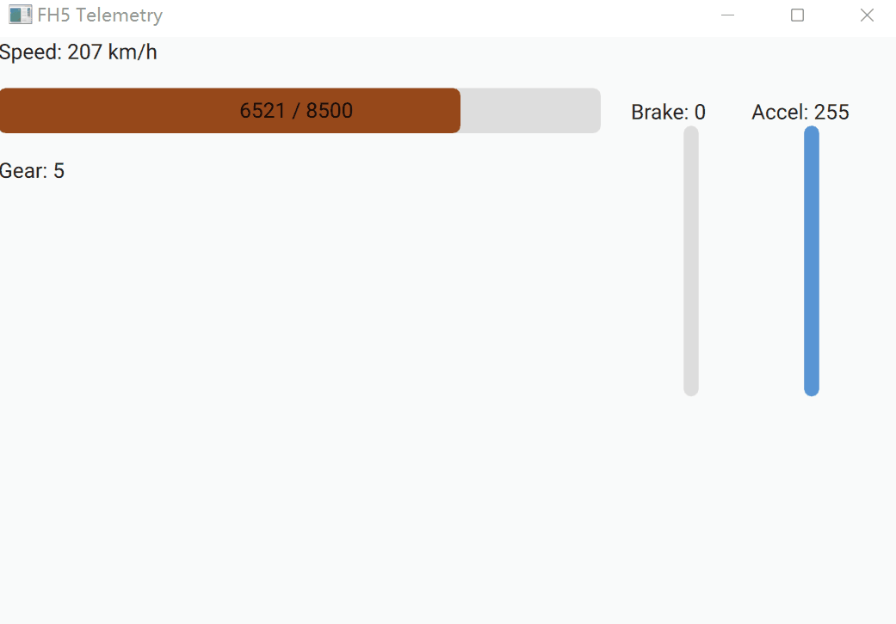

# Forza Horizon 5 telemetry
地平线5遥测数据导出

## 使用方法
### 设置Forza Horizon 5
设置 > 抬头显示器与游戏 > 开启 数据输出
设置 > 抬头显示器与游戏 > 填写 数据输出IP地址，数据输出IP端口

本地运行时：

IP: `127.0.0.1`

Port: `8000`

### 配合fh5_helper在局域网机器上显示
* 编译submodule fh5_helper
* 运行`forward.py`将数据从本机广播到局域网
* 局域网内的机器上运行fh5_helper

## 感谢
这篇讨论贴：[Data Out Telemetry Variables and Structure - Forza Horizon 5 Discussion - Forza Motorsport Forums](https://forums.forzamotorsport.net/turn10_postst169911_Data-Out-Telemetry-Variables-and-Structure.aspx)

